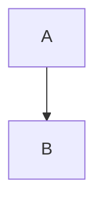
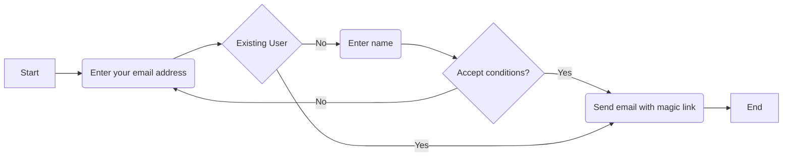

# Mermaid Tutorial

Let's go!

If you need to export the diagram, you can use [mermaid.live](https://mermaid.live).

## Flowcharts

Used to model flows, e.g. a user interacting with your application.  

Pros
- Faster than drawing
- Good for modeling flows
- Integrates with IDE
Disadvantage
- Not a lot of control to align the blocks
