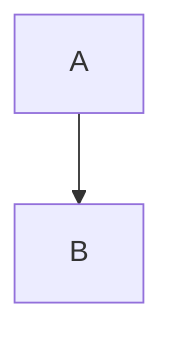
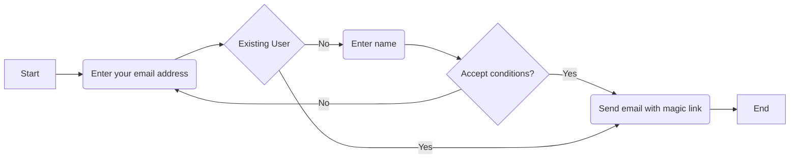
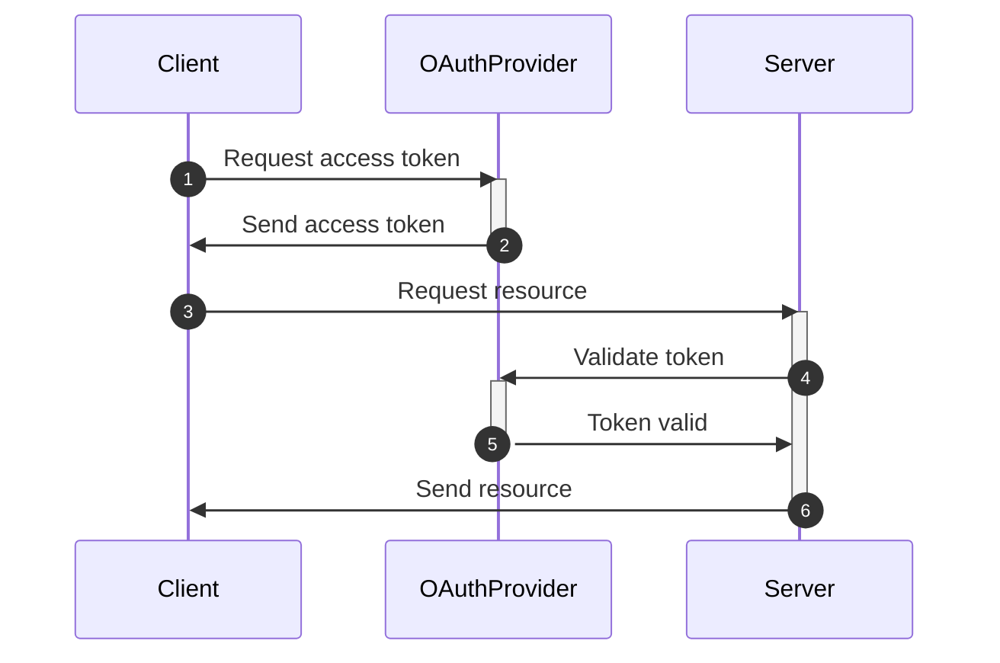
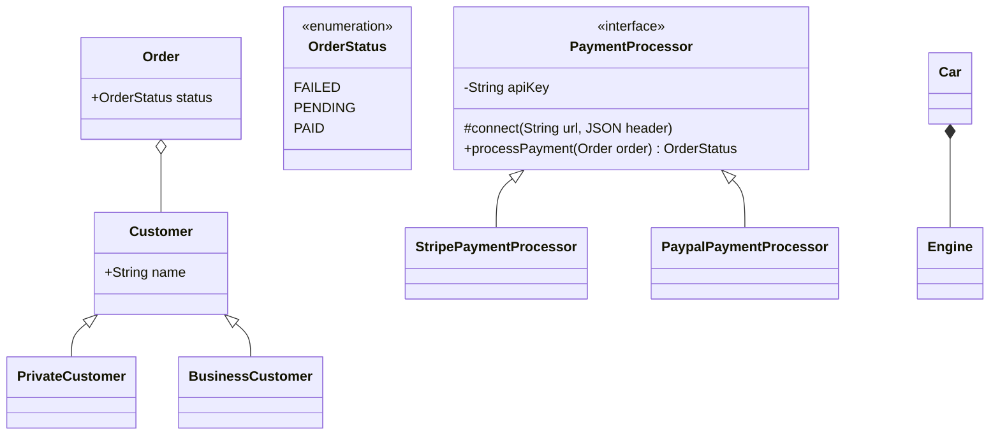
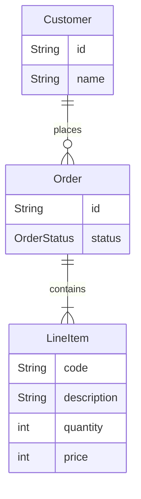

# Mermaid Tutorial

Let's go!

If you need to export the diagram, you can use [mermaid.live](https://mermaid.live).

## Flowcharts

Used to model flows, e.g. a user interacting with your application.  

Pros
- Faster than drawing
- Good for modeling flows
- Integrates with IDE
Disadvantage
- Not a lot of control to align the blocks

## Sequence Diagrams

Used to model flows when you have multiple participants. Visualize how 
participants communicate with each other.

## Class Diagrams

* Aggregation (`o--`) is a type of relationship where it can be independent 
over its lifetime.
* Composition (`*--`) is a type of relationship where the object is not
independent over its lifetime.

## Entity Relationship Diagram

A bit more generic than the class diagram. Useful to create a model within
a domain.

* `o{` means zero or more. `||` means exactly one. 
Thus, `Customer ||--o{ Order : places` means a customer can have zero or more
Orders, and an Order has exactly one Customer.
* See here for syntax: https://mermaid-js.github.io/mermaid/#/entityRelationshipDiagram
